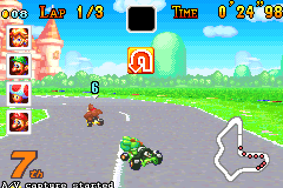

## Deep reinforcement learning applied to mario kart

This project was developed by [afcruzs](https://github.com/afcruzs) and [0xDCA](https://github.com/0xDCA) as the final project of the [machine learning course](https://fagonzalezo.github.io/ml-2016-2/) at Universidad nacional de colombia.

The agent was trained using vainilla [DQN](https://storage.googleapis.com/deepmind-media/dqn/DQNNaturePaper.pdf) adding the notion of 'check points', when the agent gets stucked for a certain amount of time (achieving a very bad reward) the training is restored to the last checkpoint, this prevents local minima and allows the agent to improve over time. Read more information in our technical report (spanish) [here](https://github.com/afcruzs/MarioKartDeepRL/blob/master/Deep_Reinforcement_learning_applied_to_Mario_Kart.pdf).

The model is executed/trained into a tiny flask server which is called from the [Bizhawk](http://tasvideos.org/BizHawk.html) emulator executing [mario_kart.lua](https://github.com/afcruzs/MarioKartDeepRL/blob/master/emulator-scripts/mario_kart.lua) in the lua interpreter.

After roughly two weeks of training the agent was able to learn how to drive in the peach circuit and achieves acceptable performance. This is an example of the model running:

